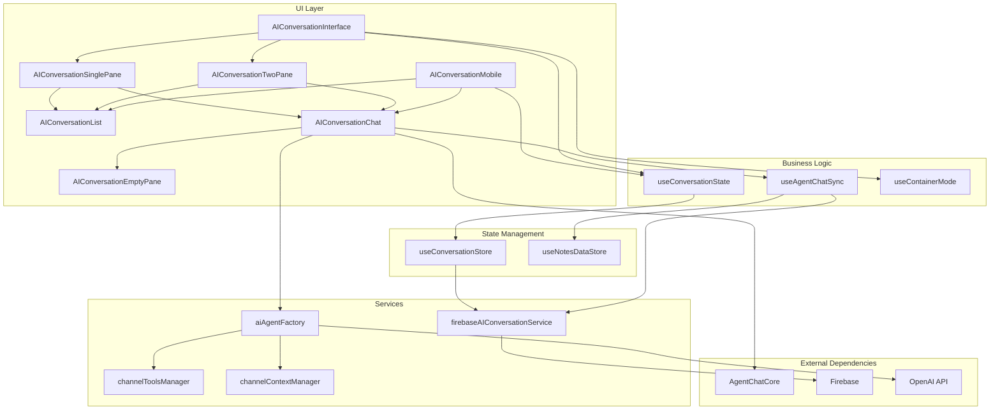
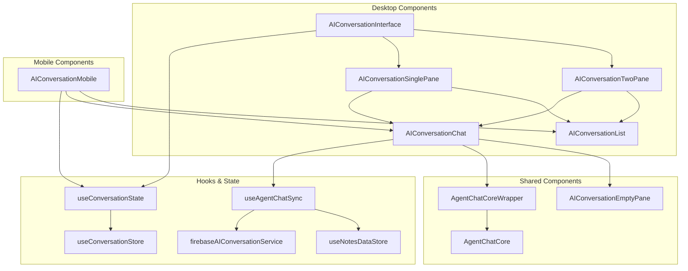
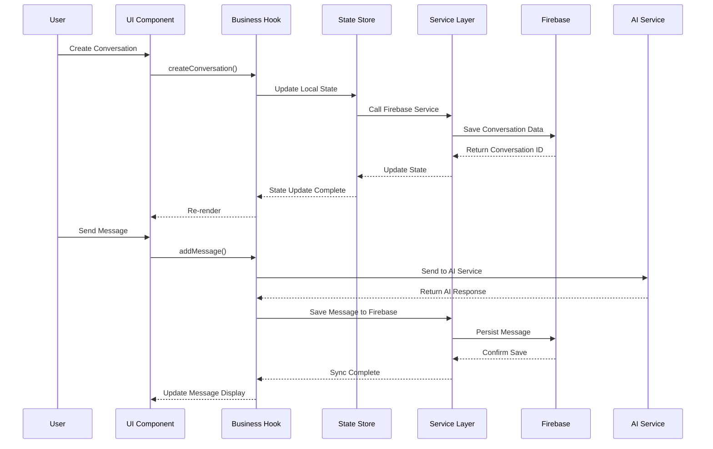

# AI Conversation 组件模块架构

## 概述

AI Conversation 模块是基于 `@agent-labs/agent-chat` 和 Firebase 的对话系统，提供完整的 AI 对话功能，包括对话管理、消息同步、工具集成等。

## 整体架构图



## 组件层次结构

### 组件关系图



### 1. 界面层 (UI Layer)

#### 桌面端组件
- **AIConversationInterface**: 对话界面主容器，负责响应式布局切换
- **AIConversationTwoPane**: 双面板布局（对话列表 + 聊天界面）
- **AIConversationSinglePane**: 单面板布局（可切换显示列表或聊天）

#### 移动端组件
- **AIConversationMobile**: 移动端对话界面，支持列表和聊天视图切换

#### 通用组件
- **AIConversationList**: 对话列表组件，显示所有对话
- **AIConversationChat**: 对话聊天组件，核心聊天界面
- **AIConversationEmptyPane**: 空状态组件，引导用户创建对话

### 2. 业务逻辑层 (Business Logic Layer)

#### 状态管理 Hooks
- **useConversationState**: 对话状态管理，提供 CRUD 操作
- **useAgentChatSync**: 消息同步管理，处理实时消息更新
- **useContainerMode**: 容器模式检测，决定使用单面板还是双面板

### 3. 状态管理层 (State Management Layer)

#### Zustand Stores
- **useConversationStore**: 对话数据状态管理
- **useNotesDataStore**: 笔记数据状态管理

### 4. 服务层 (Service Layer)

#### AI 相关服务
- **aiAgentFactory**: AI 代理工厂，创建和管理 AI 代理
- **channelToolsManager**: 频道工具管理，提供频道特定的工具
- **channelContextManager**: 频道上下文管理，提供频道上下文信息

#### 数据服务
- **firebaseAIConversationService**: Firebase 对话服务，处理数据持久化

## 数据流架构



## 核心组件详解

### AIConversationInterface

**职责**: 对话界面的主容器，负责响应式布局管理

**核心功能**:
- 检测容器尺寸，决定使用单面板还是双面板布局
- 管理对话状态和操作
- 提供统一的接口给父组件

**关键代码**:
```typescript
export const AIConversationInterface = forwardRef<ConversationInterfaceRef, ConversationInterfaceProps>(
  function AIConversationInterface({ channelId, onClose }, ref) {
    const { mode, ready } = useContainerMode(containerRef, { 
      sidebar: 320, 
      chatMin: 520, 
      hysteresis: 12, 
      debounceMs: 80 
    });
    
    return (
      <div ref={containerRef} className="h-full flex">
        {mode === "two-pane" ? (
          <AIConversationTwoPane {...props} />
        ) : (
          <AIConversationSinglePane {...props} />
        )}
      </div>
    );
  }
);
```

### AIConversationChat

**职责**: 核心聊天界面，集成 AgentChatCore

**核心功能**:
- 包装 AgentChatCore 组件
- 处理消息同步和状态管理
- 集成 AI 代理和工具

**关键代码**:
```typescript
export function AIConversationChat({ conversationId, channelId }: ConversationChatProps) {
  const { messages, createMessage, updateMessage, loading } = useAgentChatSync(conversationId, channelId);
  
  return (
    <div className="h-full flex flex-col bg-background">
      {loading ? (
        <LoadingState />
      ) : (
        <AgentChatCoreWrapper
          conversationId={conversationId}
          channelId={channelId}
          messages={messages}
          createMessage={createMessage}
          updateMessage={updateMessage}
        />
      )}
    </div>
  );
}
```

### useConversationState

**职责**: 对话状态管理 Hook

**核心功能**:
- 提供对话 CRUD 操作
- 管理当前选中的对话
- 处理加载状态和错误状态

**接口定义**:
```typescript
export interface ConversationState {
  conversations: AIConversation[];
  currentConversationId: string | null;
  currentConversation: AIConversation | null;
  loading: boolean;
  error: string | null;
}

export interface ConversationActions {
  createConversation: (userId: string, channelId: string, title: string) => Promise<AIConversation>;
  loadConversations: (userId: string, channelId?: string) => Promise<void>;
  selectConversation: (conversationId: string) => void;
  deleteConversation: (userId: string, conversationId: string) => Promise<void>;
  updateConversation: (userId: string, conversationId: string, updates: Partial<AIConversation>) => Promise<void>;
  clearError: () => void;
}
```

### useAgentChatSync

**职责**: 消息同步管理 Hook

**核心功能**:
- 实时同步消息到 Firebase
- 处理消息的创建和更新
- 管理消息加载状态

**关键实现**:
```typescript
export function useAgentChatSync(conversationId: string, _channelId: string) {
  const [messages, setMessages] = useState<UIMessage[]>([]);
  const [loading, setLoading] = useState(true);
  
  // 实时监听消息变化
  useEffect(() => {
    if (!userId || !conversationId) return;
    
    const unsubscribe = firebaseAIConversationService.subscribeToMessages(
      userId, 
      conversationId, 
      setMessages
    );
    
    return unsubscribe;
  }, [userId, conversationId]);
  
  return { messages, loading, createMessage, updateMessage, loadMoreMessages };
}
```

## 数据模型

### AIConversation 接口

```typescript
interface AIConversation {
  id: string;
  title: string;
  channelId: string;
  userId: string;
  createdAt: Date;
  updatedAt: Date;
  lastMessageAt: Date;
  messageCount: number;
  isArchived: boolean;
}
```

### UIMessage 接口

```typescript
type UIMessage = {
  id: string;
  role: "user" | "assistant" | "system";
  parts: MessagePart[];
}
```

## Firebase 数据结构

```
users/{userId}/aiConversations/{conversationId}
├── metadata (AIConversation)
└── uiMessages/{messageId} (UIMessage)
```

## 关键特性

### 1. 响应式布局
- 自动检测容器尺寸
- 动态切换单面板/双面板布局
- 移动端优化的界面

### 2. 实时同步
- Firebase 实时监听消息变化
- 防抖处理避免频繁更新
- 乐观更新提升用户体验

### 3. AI 集成
- 基于 @agent-labs/agent-chat
- 支持工具调用和上下文管理
- 频道特定的 AI 配置

### 4. 状态管理
- Zustand 状态管理
- 类型安全的状态操作
- 错误处理和加载状态

## 使用示例

### 基本使用

```typescript
// 在页面组件中使用
export function ChatPage() {
  const { channelId } = useParams();
  
  return (
    <AIConversationInterface
      channelId={channelId}
      onClose={() => navigate('/')}
    />
  );
}
```

### 状态管理

```typescript
// 使用对话状态
const { 
  conversations, 
  currentConversation, 
  createConversation, 
  selectConversation 
} = useConversationState();

// 创建新对话
const handleCreateConversation = () => {
  createConversation(userId, channelId, "New Conversation");
};

// 选择对话
const handleSelectConversation = (id: string) => {
  selectConversation(id);
};
```

### 消息同步

```typescript
// 使用消息同步
const { 
  messages, 
  loading, 
  createMessage, 
  updateMessage 
} = useAgentChatSync(conversationId, channelId);
```

## 架构优势

### 1. 模块化设计
- 清晰的组件分层
- 职责分离明确
- 易于维护和扩展

### 2. 类型安全
- 完整的 TypeScript 类型定义
- 编译时错误检查
- 更好的开发体验

### 3. 性能优化
- 防抖处理减少不必要的更新
- 乐观更新提升响应速度
- 组件懒加载

### 4. 可扩展性
- 插件化的工具系统
- 灵活的上下文管理
- 支持多种 AI 模型

## 未来扩展

### 1. 多模态支持
- 图片和文件上传
- 语音消息支持
- 富文本编辑

### 2. 高级功能
- 对话搜索和过滤
- 对话导出和导入
- 自定义 AI 角色

### 3. 性能优化
- 虚拟滚动
- 消息分页加载
- 缓存策略优化

---

*本文档详细描述了 AI Conversation 模块的组件架构，包括组件层次、数据流、核心功能和使用示例。该架构遵循了清晰的分层设计原则，提供了良好的可维护性和扩展性。*
