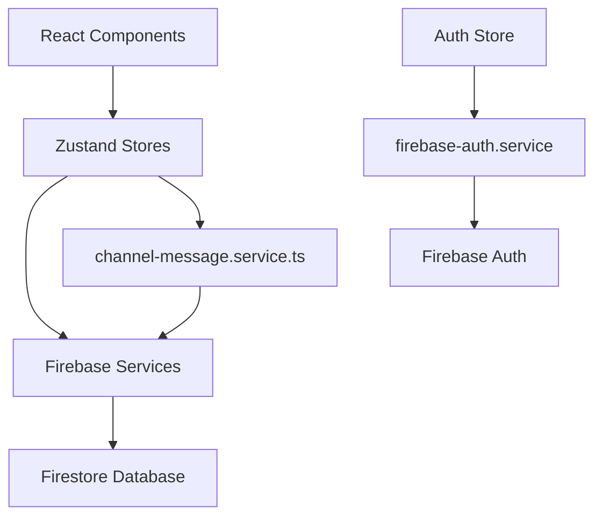
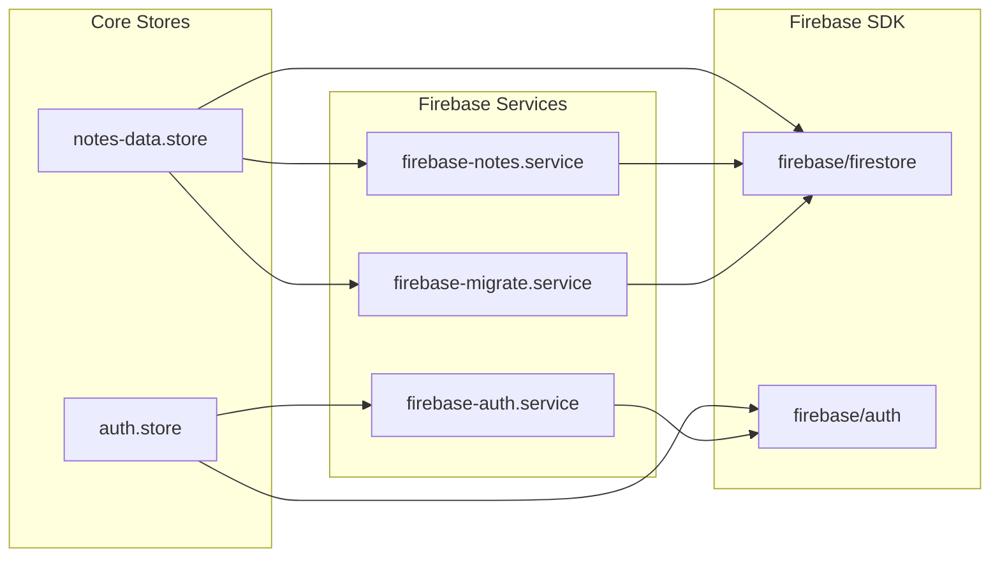
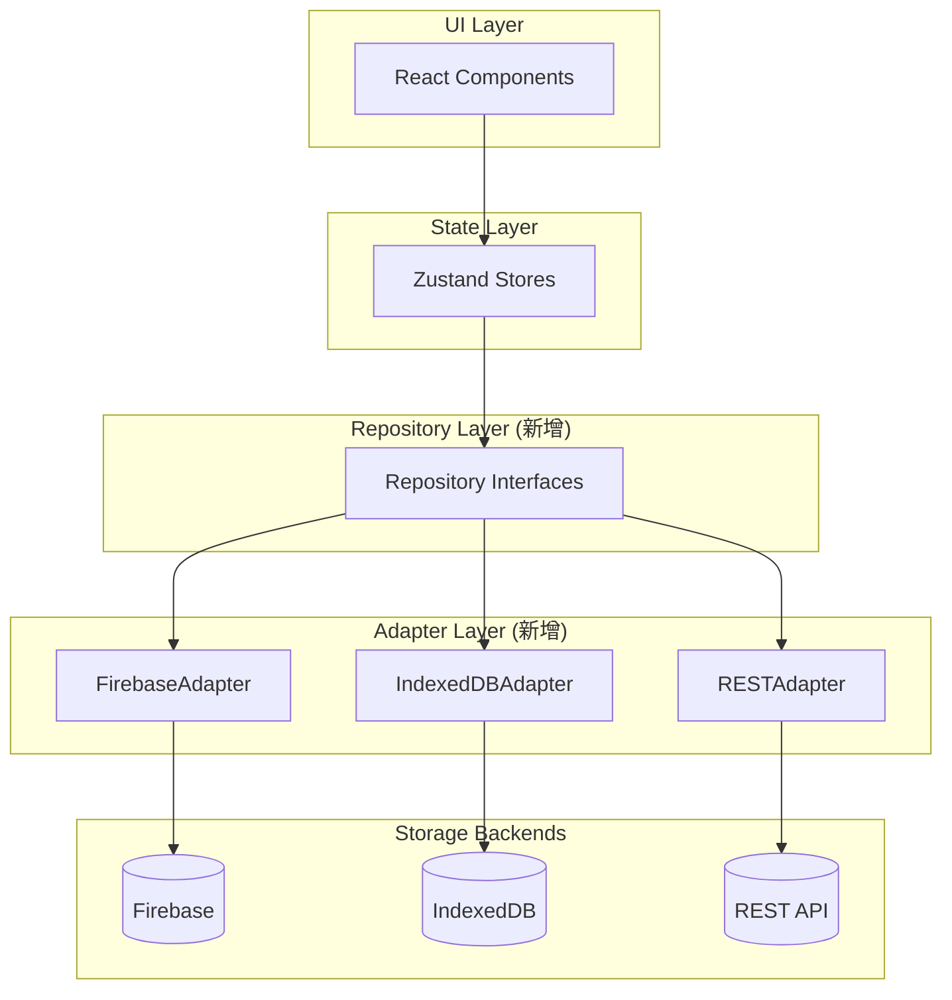
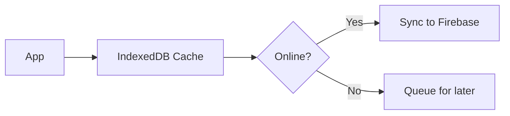

# StillRoot 存储层架构分析与重构方案

## 📋 概述

本文档分析 StillRoot 项目当前的存储层架构，识别与 Firebase 的耦合点，并提供解耦方案以支持多后端（Firebase、IndexedDB、REST API 等）。

---

## 🏗️ 当前架构

### 项目结构

```
src/
├── common/
│   ├── config/
│   │   └── firebase.config.ts          # Firebase 配置单例
│   ├── services/
│   │   └── firebase/                    # Firebase 服务层
│   │       ├── firebase-auth.service.ts
│   │       ├── firebase-notes.service.ts
│   │       ├── firebase-ai-conversation.service.ts
│   │       └── firebase-migrate.service.ts
│   ├── hooks/
│   │   └── use-firebase-auth.ts
│   └── components/firebase/             # Firebase UI 组件
├── core/
│   ├── stores/                          # Zustand stores
│   │   ├── notes-data.store.ts          # 主数据存储 (598行)
│   │   └── auth.store.ts                # 认证存储 (263行)
│   └── services/
│       └── channel-message.service.ts   # 消息服务 (424行)
```

### 数据流



---

## ⚠️ 耦合问题分析

### 1. 直接导入 Firebase SDK 类型

以下核心文件直接导入 Firebase SDK 类型，形成强耦合：

| 文件 | 导入的 Firebase 类型 |
|------|---------------------|
| [notes-data.store.ts](file:///Users/tongwenwen/Projects/Peiiii/StillRoot/src/core/stores/notes-data.store.ts) | `DocumentSnapshot` |
| [auth.store.ts](file:///Users/tongwenwen/Projects/Peiiii/StillRoot/src/core/stores/auth.store.ts) | `User` from firebase/auth |
| [notes-view.store.ts](file:///Users/tongwenwen/Projects/Peiiii/StillRoot/src/core/stores/notes-view.store.ts) | `User` from firebase/auth |
| [channel-message.service.ts](file:///Users/tongwenwen/Projects/Peiiii/StillRoot/src/core/services/channel-message.service.ts) | `QueryDocumentSnapshot`, `DocumentData` |

### 2. Store 直接调用 Firebase 服务

`notes-data.store.ts` 中的关键耦合点：

```typescript
// 第1-5行: 直接导入 Firebase 服务和类型
import { firebaseNotesService } from "@/common/services/firebase/firebase-notes.service";
import { firebaseMigrateService } from "@/common/services/firebase/firebase-migrate.service";
import { DocumentSnapshot } from "firebase/firestore";

// 第62-63行: 状态中包含 Firebase 特有类型
export interface ChannelMessageState {
  lastVisible: DocumentSnapshot | null;  // ❌ Firebase 特有类型
}

// 第498行: 直接调用 Firebase 服务
const unsubscribeChannels = firebaseNotesService.subscribeToChannels(userId, channels => {...});
```

### 3. 耦合统计

| 耦合类型 | 文件数量 |
|----------|---------|
| 直接导入 firebase/* | 50+ |
| 导入 firebase services | 15+ |
| 使用 Firebase 特有类型 | 8 |

### 4. 关键依赖图



---

## 🎯 解耦目标

1. **多后端支持**: Firebase Firestore、IndexedDB、REST API
2. **易于测试**: 可 mock 存储层进行单元测试
3. **渐进式迁移**: 不破坏现有功能的情况下逐步重构
4. **类型安全**: 保持 TypeScript 类型检查

---

## 📐 推荐方案：Repository 模式 + 依赖注入

### 目标架构



### 核心接口设计

#### 1. 通用类型定义
```typescript
// src/core/storage/types.ts

// 分页游标 - 替代 DocumentSnapshot
export interface PaginationCursor {
  value: unknown;
  field: string;
}

// 订阅返回类型
export type Unsubscribe = () => void;

// 通用用户类型 - 替代 Firebase User
export interface AppUser {
  id: string;
  email: string | null;
  displayName: string | null;
  emailVerified: boolean;
  photoURL: string | null;
}
```

#### 2. Notes Repository 接口
```typescript
// src/core/storage/repositories/notes.repository.ts

export interface NotesRepository {
  // Channels
  getChannel(userId: string, channelId: string): Promise<Channel | null>;
  fetchChannels(userId: string): Promise<Channel[]>;
  createChannel(userId: string, channel: ChannelInput): Promise<string>;
  updateChannel(userId: string, channelId: string, updates: Partial<ChannelInput>): Promise<void>;
  deleteChannel(userId: string, channelId: string): Promise<void>;
  
  // Messages
  fetchMessages(userId: string, channelId: string, options: FetchOptions): Promise<PaginatedResult<Message>>;
  createMessage(userId: string, message: MessageInput): Promise<void>;
  updateMessage(userId: string, messageId: string, updates: Partial<MessageInput>): Promise<void>;
  deleteMessage(userId: string, messageId: string): Promise<void>;
  moveMessage(userId: string, messageId: string, fromChannelId: string, toChannelId: string): Promise<void>;
  
  // Subscriptions
  subscribeToChannels(userId: string, onUpdate: (channels: Channel[]) => void): Unsubscribe;
  subscribeToMessages(userId: string, channelId: string, onUpdate: (messages: Message[]) => void): Unsubscribe;
}
```

#### 3. Auth Repository 接口
```typescript
// src/core/storage/repositories/auth.repository.ts

export interface AuthRepository {
  signInWithGoogle(): Promise<AppUser | null>;
  signInWithEmail(email: string, password: string): Promise<AppUser | null>;
  signUpWithEmail(email: string, password: string, displayName?: string): Promise<{ user: AppUser; verificationSent: boolean }>;
  signOut(): Promise<void>;
  sendPasswordReset(email: string): Promise<void>;
  sendEmailVerification(): Promise<void>;
  getCurrentUser(): Promise<AppUser | null>;
  onAuthStateChanged(callback: (user: AppUser | null) => void): Unsubscribe;
}
```

#### 4. Storage Provider 工厂
```typescript
// src/core/storage/storage-provider.ts

export interface StorageProvider {
  notes: NotesRepository;
  auth: AuthRepository;
  conversations: ConversationsRepository;
}

export type StorageBackendType = 'firebase' | 'indexeddb' | 'rest';

export function createStorageProvider(backend: StorageBackendType): StorageProvider {
  switch (backend) {
    case 'firebase':
      return {
        notes: new FirebaseNotesAdapter(),
        auth: new FirebaseAuthAdapter(),
        conversations: new FirebaseConversationsAdapter(),
      };
    case 'indexeddb':
      return {
        notes: new IndexedDBNotesAdapter(),
        auth: new LocalAuthAdapter(),
        conversations: new IndexedDBConversationsAdapter(),
      };
    // ... 其他后端
  }
}
```

---

## 📁 目标目录结构

```
src/core/storage/
├── types.ts                    # 通用类型定义
├── storage-provider.ts         # Provider 工厂
├── storage-context.tsx         # React Context
│
├── repositories/               # 接口定义
│   ├── notes.repository.ts
│   ├── auth.repository.ts
│   └── conversations.repository.ts
│
└── adapters/                   # 具体实现
    ├── firebase/
    │   ├── firebase-notes.adapter.ts
    │   ├── firebase-auth.adapter.ts
    │   └── firebase-conversations.adapter.ts
    │
    ├── indexeddb/
    │   ├── indexeddb-notes.adapter.ts
    │   ├── local-auth.adapter.ts
    │   └── indexeddb-conversations.adapter.ts
    │
    └── rest/
        └── ...
```

---

## 📋 实施路线图

### Phase 1: 抽象层引入
- [ ] 创建 `src/core/storage/` 目录结构
- [ ] 定义通用类型 (`types.ts`)
- [ ] 创建 Repository 接口
- [ ] 将现有 Firebase 服务包装成 Adapter
- [ ] Stores 改用接口调用（无功能变化）

### Phase 2: 添加 IndexedDB Adapter
- [ ] 实现 `IndexedDBNotesAdapter`
- [ ] 实现本地认证 `LocalAuthAdapter`
- [ ] 配置切换机制

### Phase 3: 优化 & 清理
- [ ] 移除 stores 中的 Firebase 直接依赖
- [ ] Bundle 分离（按需加载 Firebase）
- [ ] 添加单元测试

---

## 🔑 关键重构示例

### Before: notes-data.store.ts

```typescript
import { firebaseNotesService } from "@/common/services/firebase/firebase-notes.service";
import { DocumentSnapshot } from "firebase/firestore";

export interface ChannelMessageState {
  lastVisible: DocumentSnapshot | null;  // ❌ Firebase 类型
}

// 直接调用 Firebase 服务
addChannel: async (userId, channel) => {
  await firebaseNotesService.createChannel(userId, channel);
}
```

### After: notes-data.store.ts

```typescript
import { NotesRepository, PaginationCursor } from "@/core/storage";
import { getStorageProvider } from "@/core/storage/storage-context";

export interface ChannelMessageState {
  lastVisible: PaginationCursor | null;  // ✅ 通用类型
}

// 通过 Repository 接口调用
addChannel: async (userId, channel) => {
  const notesRepo = getStorageProvider().notes;
  await notesRepo.createChannel(userId, channel);
}
```

---

## 💡 额外考虑

### 离线支持策略
使用 IndexedDB 作为缓存层，实现离线优先架构：



### 认证策略选项
IndexedDB 场景下：
- **无需认证**: 纯本地应用
- **本地认证**: 简单密码/PIN
- **保留云认证选项**: 可切换

### 渐进式迁移优势
- 每一步都可测试、可回滚
- 不会打断现有用户
- 可以先快速验证架构是否合理

---

## 📊 风险评估

| 风险 | 可能性 | 影响 | 缓解措施 |
|------|--------|------|----------|
| 重构引入 bug | 中 | 高 | 增量迁移 + 测试覆盖 |
| 性能下降 | 低 | 中 | 性能测试 + 优化 |
| 团队学习成本 | 低 | 低 | 文档 + 示例代码 |

---

## 🎯 总结

**当前问题：**
- 50+ 文件直接导入 Firebase SDK
- 核心 stores 依赖 Firebase 特有类型
- 无抽象层隔离存储实现

**推荐方案：Repository 模式 + 依赖注入**
- ✅ 支持多后端（Firebase、IndexedDB、REST）
- ✅ 提高可测试性
- ✅ 渐进式迁移，降低风险
- ✅ 为离线功能打下基础

---

## ✅ 优化后的推荐方案（更贴合 StillRoot）

下面是在“Repository + Adapter”方向上，针对 StillRoot 现状做的几处关键优化（避免后续接入 IndexedDB/REST 时出现接口不匹配与反向依赖）。

### 1) 先把领域模型从 Store 中抽离（最关键）

当前存在基础设施层反向依赖 Zustand store 的问题：`firebase-notes.service.ts` 直接 import `Message/Channel` 自 `notes-data.store.ts`，会导致“store 变成领域模型源头”，难以替换后端与复用类型。

**建议：**
- 新增 `src/core/domain/notes.ts`、`src/core/domain/auth.ts`、`src/core/domain/ai-conversation.ts`
- `stores/`、`repositories/`、`adapters/` 均只依赖 `core/domain/*`，不互相穿透

### 2) 游标（Cursor）用“不透明 token”，不要做伪通用结构

Firestore 的分页游标天然是 `DocumentSnapshot`；REST 常见的是 `nextCursor: string`；IndexedDB 常见的是复合键 `(timestamp,id)`。

如果设计成 `{ field, value }` 这种“看起来通用”的结构，最终会：
- 在 Firestore 侧丢失必要信息（导致 adapter 仍然要泄漏 Firestore 类型）
- 在 REST/IndexedDB 侧强行拼字段（导致实现很别扭）

**建议：不透明游标：**
```ts
export type Cursor = string;
```

由 adapter 自己 encode/decode（例如 `firebase` adapter 内部可以把 snapshot 序列化成 token 或在内存中维护映射表）。

### 3) Realtime/Subscription 作为“可选能力”，不要强制所有后端实现

Firestore 很适合 `onSnapshot`；REST/IndexedDB 往往只能：
- 轮询（polling）
- 手动 refresh
- 或只支持“本地变更订阅”（local-first 才自然）

**建议：在接口层显式标注能力：**
```ts
export interface NotesRepositoryCapabilities {
  realtime: boolean;
  pagination: "cursor" | "offset" | "none";
}

export interface NotesRepository {
  readonly capabilities: NotesRepositoryCapabilities;
  // ...
}
```

store/service 层根据 `capabilities.realtime` 选择订阅或定时刷新，而不是让 adapter 硬凑“假的实时订阅”。

### 4) Auth 抽象成 AppUser，并明确“离线/本地用户”策略

你文档里的 `AppUser` 很好，但 IndexedDB/离线模式必须提前定一个产品策略：
- 纯本地：允许匿名/多 profile？
- 云端账号：本地数据如何与 userId 绑定？如何合并/冲突？

**建议接口增加语义：**
- `auth.getSession()`（当前会话/身份）
- `auth.getCurrentUser()`（与云端账号相关）
- local-first 时，允许 `sessionId` 与 `userId` 不同

### 5) Provider 选择机制：先做“简单可替换”，再引入 React Context

为减少重构面，建议第一阶段用简单工厂 + 单例 getter（从 env/feature flag 读取）：
- `createStorageProvider(backend)`
- `getStorageProvider()`（应用级单例）

等到需要“多 workspace/多账户/多实例”时，再升级到 `storage-context.tsx`。

### 6) 迁移（migrations）归位：从“Firebase 专属”走向“Adapter 内部细节”

当前迁移写在 `src/common/services/firebase/*`，并在 `useNotesDataStore.initFirebaseListeners` 里跑。

**建议：**
- 将迁移视为 `FirebaseNotesAdapter` 的初始化细节：`provider.initialize()` 内部执行
- Store 只做“初始化 provider”，而不是“知道 Firebase 迁移怎么跑”

---

## 📦 推荐目录结构（落地版）

在你文档的目标结构基础上，建议加入 `domain/` 并把 cursor/capabilities 固化：

```
src/core/
├── domain/
│   ├── notes.ts
│   ├── auth.ts
│   └── ai-conversation.ts
└── storage/
    ├── types.ts
    ├── provider.ts
    ├── repositories/
    │   ├── notes.repository.ts
    │   ├── auth.repository.ts
    │   └── conversations.repository.ts
    └── adapters/
        ├── firebase/
        ├── indexeddb/
        └── rest/
```

---

## 🧩 接口草案（优化版）

### 通用类型（`src/core/storage/types.ts`）
```ts
export type Unsubscribe = () => void;
export type Cursor = string;

export type SortDirection = "asc" | "desc";

export type PaginatedResult<T> = {
  items: T[];
  nextCursor: Cursor | null;
};
```

### NotesRepository（`src/core/storage/repositories/notes.repository.ts`）
```ts
import type { Channel, Message } from "@/core/domain/notes";
import type { Cursor, PaginatedResult, Unsubscribe } from "@/core/storage/types";

export interface NotesRepositoryCapabilities {
  realtime: boolean;
  pagination: "cursor" | "offset" | "none";
}

export type ListMessagesOptions = {
  limit: number;
  cursor?: Cursor | null;
  includeSenders?: Array<"user" | "ai">;
};

export interface NotesRepository {
  readonly capabilities: NotesRepositoryCapabilities;

  listChannels(userId: string): Promise<Channel[]>;
  createChannel(userId: string, input: Omit<Channel, "id" | "createdAt" | "messageCount">): Promise<string>;
  updateChannel(userId: string, channelId: string, updates: Partial<Channel>): Promise<void>;
  deleteChannel(userId: string, channelId: string): Promise<void>;

  listMessages(userId: string, channelId: string, options: ListMessagesOptions): Promise<PaginatedResult<Message>>;
  createMessage(userId: string, input: Omit<Message, "id" | "timestamp">): Promise<string>;
  updateMessage(userId: string, messageId: string, updates: Partial<Message>): Promise<void>;
  deleteMessage(userId: string, messageId: string, options?: { hardDelete?: boolean }): Promise<void>;
  moveMessage(userId: string, messageId: string, fromChannelId: string, toChannelId: string): Promise<void>;

  subscribeChannels?(userId: string, onUpdate: (channels: Channel[]) => void): Unsubscribe;
  subscribeNewMessages?(userId: string, channelId: string, after: Date, onUpdate: (messages: Message[]) => void): Unsubscribe;
}
```

> 注意：`subscribe*` 用可选方法（`?`），让 REST/IndexedDB 不必硬实现。

---

## 🗺️ 渐进式迁移路线（StillRoot 版）

### Phase 0（准备）：抽 domain types
- 把 `Message/Channel/AIConversation` 从 `stores/*.ts` 抽到 `core/domain/*`
- 让 `firebase-*.service.ts` 改为依赖 `core/domain/*`（立刻消除“基础设施层依赖 store”）

### Phase 1（最小改动）：引入 NotesRepository/AuthRepository + FirebaseAdapter
- 新增 `core/storage/*` 接口与 provider
- `FirebaseNotesAdapter` 内部直接复用现有 `firebaseNotesService`（先不重写 Firestore 查询）
- 改两处调用点：
  - `src/core/stores/notes-data.store.ts`（channels CRUD）
  - `src/core/services/channel-message.service.ts`（list/subscribe/pagination）

### Phase 2（扩展）：IndexedDB
二选一（取决于产品目标）：
- **缓存/搜索层**：保持 Firebase 为 source of truth，IndexedDB 仅 cache + index（你们现在的 `LocalDataManagerService` 路线）
- **local-first 主存储**：需要 outbox（离线写入队列）+ 同步/冲突策略（这会显著扩展 scope）

### Phase 3（REST 后端）
- 实现 `RestNotesAdapter`，优先走“非实时 + cursor token”
- 若需要近实时体验，在 store/service 层用 polling（而不是让 adapter 假装 onSnapshot）

---

## 🧱 落地注意事项（避免返工）

### Firebase Cursor token 的两种实现方式
- **内存映射（推荐第一版）**：adapter 内部维护 `Map<Cursor, DocumentSnapshot>`，`Cursor` 是随机 id；优点是实现简单、不会泄漏 Firebase 类型；缺点是刷新页面后游标失效（但这通常可接受）。
- **可序列化 token（适合第二版）**：把分页锚点转换为稳定键（例如 `timestamp + messageId` 组合），Firestore 查询改为 `orderBy("timestamp").orderBy("__name__")` 并用 `startAfter(ts, id)`；优点是可持久化；缺点是需要调整索引与查询方式。

### Bundle 解耦（可选但高收益）
当前 `firebase` 是主依赖之一（`package.json`），引入 adapter 后可以进一步做按需加载：
- `createStorageProvider("firebase")` 内部 `await import("firebase/*")`（或延迟 import 现有 `firebase-*.service.ts`）
- 非 Firebase 后端时不把 firebase 打进首屏 bundle

### 迁移（migrations）触发点建议
把 `firebaseMigrateService.runAllMigrations(userId)` 从 store 中移出，放到：
- `FirebaseStorageProvider.initialize(userId)` 或 `FirebaseNotesAdapter.initialize(userId)`

Store 只负责调用 `provider.initialize()`，不关心“迁移系统属于哪个后端”。

---

## ✅ 建议的第一刀改动（最小 PR 切片）

1. 新增 `src/core/domain/notes.ts`，并把 `Message/Channel` 从 `src/core/stores/notes-data.store.ts` 迁走
2. 调整 `src/common/services/firebase/firebase-notes.service.ts` 不再 import store 类型，改为 import `core/domain/notes`
3. 新增 `src/core/storage/types.ts`（`Cursor/Unsubscribe/PaginatedResult`）

这一刀改完，你们的“基础设施层反向依赖 store”问题就解决了，后续 repository/adapter 的引入会顺很多。
